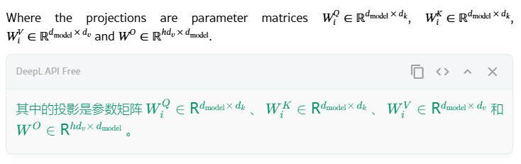
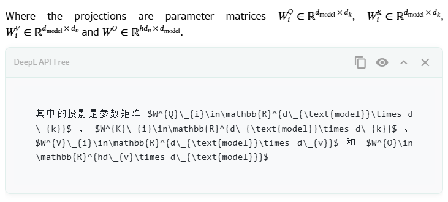
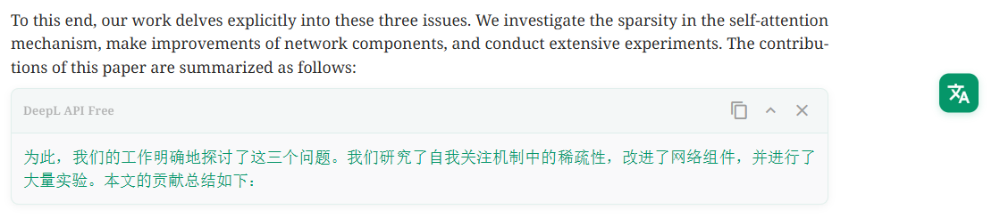

# Hell の Translator

一个基于 DeepL API 的浏览器翻译扩展，支持 LaTeX 公式和 Markdown 格式的智能翻译。

## 主要功能

1. **智能翻译**
   - 支持选中文本即时翻译
   - 可拖拽的悬浮翻译按钮
   - 目标语言默认为中文
   - 优雅的加载状态显示
   - 完善的错误处理和重试机制
   
2. **LaTeX 支持**
   - 自动识别和保护 LaTeX 公式
   - 支持行内公式 (`$...$`) 和行间公式 (`$$...$$`)
   - 支持多种数学环境（MathML、MathJax、KaTeX）

3. **Markdown 支持**
   - 支持 Markdown 格式的文本翻译
   - 保持原有格式不变
   - 提供 Markdown 源码查看功能

4. **用户界面**
   - Material Design 风格界面
   - 实时翻译状态反馈
   - 优雅的加载动画
   - 清晰的错误提示
   - 一键重试功能
   - 支持翻译结果的复制、折叠/展开
   - 显示原始 Markdown 代码
   - 可拖拽定位的翻译按钮

## 使用方法
1.在浏览器的扩展中启用开发者模型，然后打开下载后的 `TranslationScript` 文件夹，加载正在已解压的扩展程序
2.打开需要翻译的网页，在扩展程序中点击该扩展程序，页面右上角会出现一个翻译按钮
3. 选择需要翻译的文本
4. 点击翻译按钮开始翻译：
   - 显示优雅的加载动画
   - 实时反馈翻译状态
   - 如果失败，显示错误信息和重试按钮
5. 在翻译结果框中可以：
   - 复制翻译内容
   - 查看 Markdown 源码
   - 折叠/展开翻译结果
   - 关闭翻译结果
   - 遇到错误时一键重试

## 注意事项

1. 需要配置有效的 DeepL API Free 密钥
2. 翻译结果中的数学公式会保持原样
3. 支持的数学公式环境：
   - MathML
   - MathJax
   - KaTeX
4. 建议在科技文档或学术文献上使用
5. 如遇到翻译失败：
   - 检查网络连接
   - 确认 API 密钥有效
   - 使用重试按钮重新翻译
   - 如果持续失败，可能是当日 API 配额已用完

## 效果展示
### 2024.12.30 更新翻译动画和错误处理

#### 翻译状态显示

- **加载中**: 显示 "DeepL API Free 正在翻译..." 的提示，配有优雅的淡入淡出动画
- **翻译完成**: 显示格式化后的翻译结果，支持 Markdown 渲染和 LaTeX 公式显示
- **错误状态**: 显示具体的错误信息，并提供重试选项

#### 错误处理机制

1. **API 错误**
   - 显示具体的 API 错误信息
   - 提供醒目的重试按钮
   - 保留原文本内容，支持一键重试

2. **网络错误**
   - 显示网络相关的错误提示
   - 自动保存上次选中的文本
   - 点击重试时无需重新选择文本

3. **重试功能**
   - 重试按钮位于错误提示旁
   - 点击重试时自动使用上次的文本
   - 重试过程中显示新的加载状态
   - 重试成功/失败都有清晰的状态反馈

### 2024.12.26 更新公式识别与复制
加入了能够识别公式的部分，并且在复制时会带上latex公式的代码。效果如下

复制latex/markdown

### 2024.12.25 第一版
